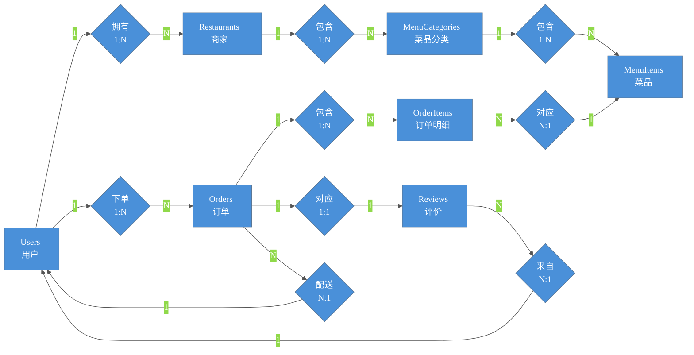
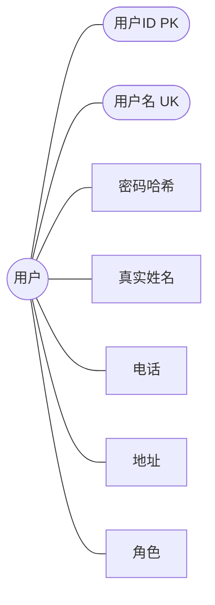
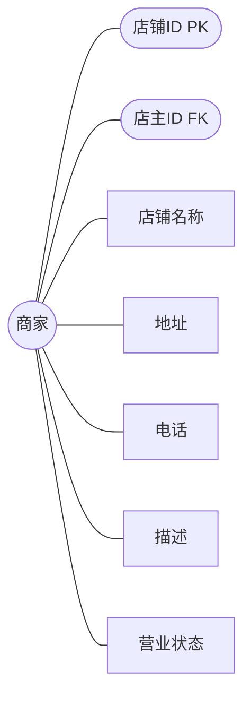
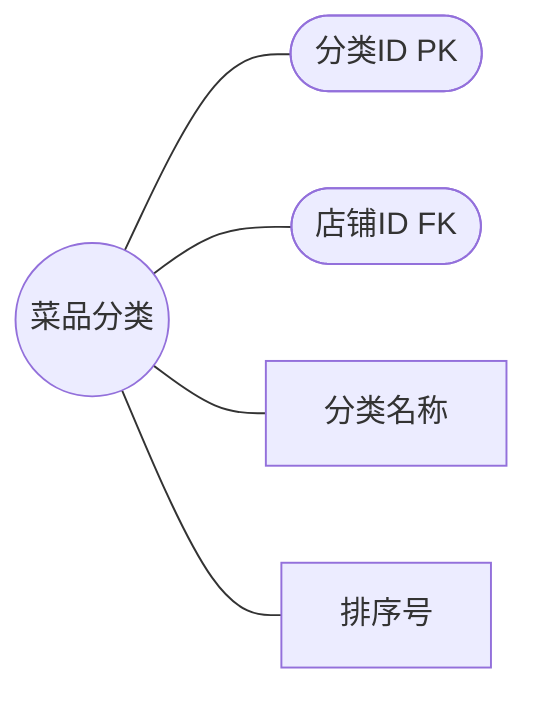
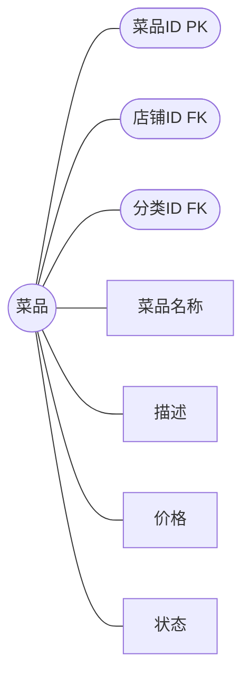
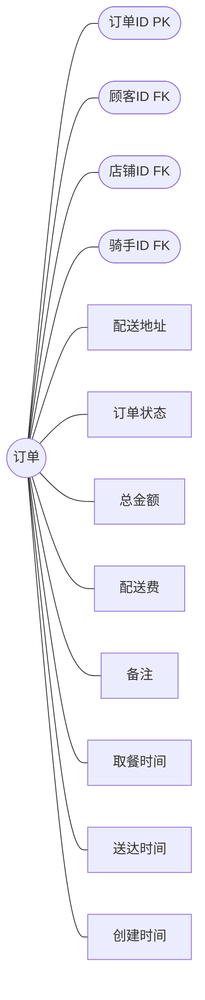
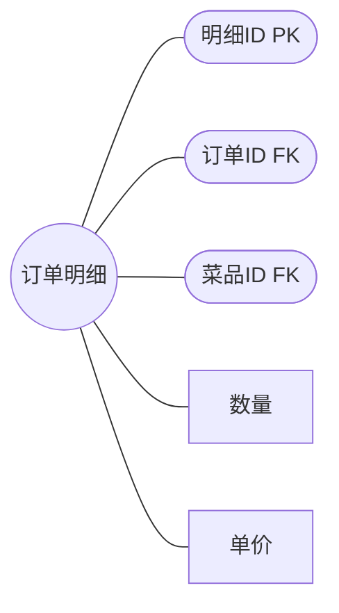
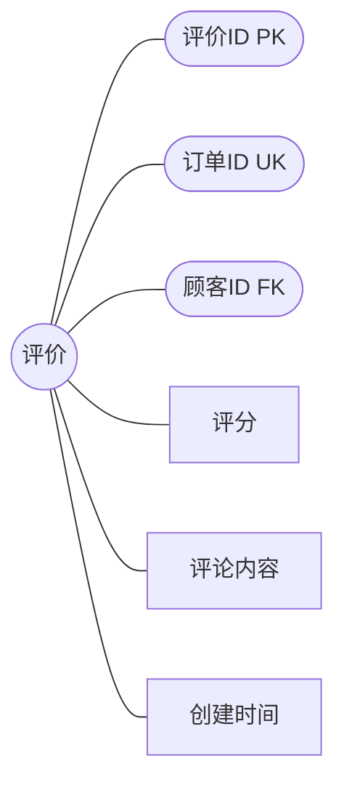

## 总ER图

该 E-R 模型完整描述外卖配送系统中各实体间的关联关系，涵盖用户、商家、菜品分类、菜品、订单、订单明细、评价共 7 个实体。其中用户与商家之间存在一对多联系"拥有"；用户与订单之间存在一对多联系"下单"（顾客角色）和"配送"（骑手角色）；商家与菜品分类、菜品之间存在一对多联系"包含"；菜品分类与菜品之间存在一对多联系"归类"；订单与订单明细之间存在一对多联系"包含明细"；菜品与订单明细之间存在多对一联系"对应菜品"；订单与评价之间存在一对一联系"获得评价"；用户与评价之间存在一对多联系"发表评价"。该模型为后续逻辑结构设计与数据库实现提供清晰的概念框架。

# 用户实体属性 E-R 图

实体为用户，属性包括：用户ID、用户名、密码哈希、真实姓名、电话、地址、角色。其中用户ID为主键，用户名为唯一键。角色字段限定为顾客、商家、骑手三种取值，新用户注册时自主选择身份，系统基于角色实现权限分级控制。

# 商家实体属性 E-R 图

实体为商家，属性包括：店铺ID、店主ID、店铺名称、地址、电话、描述、营业状态。其中店铺ID为主键，店主ID为外键关联用户表。营业状态在"营业中"与"已歇业"之间切换，歇业店铺对顾客不可见。

# 菜品分类实体属性 E-R 图

实体为菜品分类，属性包括：分类ID、店铺ID、分类名称、排序号。其中分类ID为主键，店铺ID为外键关联商家表。排序号用于前端拖拽排序，数值越小展示越靠前。

# 菜品实体属性 E-R 图

实体为菜品，属性包括：菜品ID、店铺ID、分类ID、菜品名称、描述、价格、状态。其中菜品ID为主键，店铺ID和分类ID为外键分别关联商家表和分类表。状态控制菜品上下架，仅上架菜品对顾客可见。

# 订单实体属性 E-R 图

实体为订单，属性包括：订单ID、顾客ID、店铺ID、骑手ID、配送地址、订单状态、总金额、配送费、备注、取餐时间、送达时间、创建时间。其中订单ID为主键，顾客ID、店铺ID、骑手ID为外键分别关联用户表和商家表。订单状态随商家和骑手操作依次流转，涵盖待处理、已确认、备餐中、待取餐、配送中、已取餐、已送达、已取消共 8 种状态。

# 订单明细实体属性 E-R 图

实体为订单明细，属性包括：明细ID、订单ID、菜品ID、数量、单价。其中明细ID为主键，订单ID和菜品ID为外键分别关联订单表和菜品表。每条明细记录顾客所点的一个菜品及其数量和下单时单价，多条明细汇总构成订单总金额。

# 评价实体属性 E-R 图

实体为评价，属性包括：评价ID、订单ID、顾客ID、评分、评论内容、创建时间。其中评价ID为主键，订单ID为唯一外键（一个订单仅对应一条评价），顾客ID为外键关联用户表。评分限定 1-5 星，仅已送达订单可评价。

