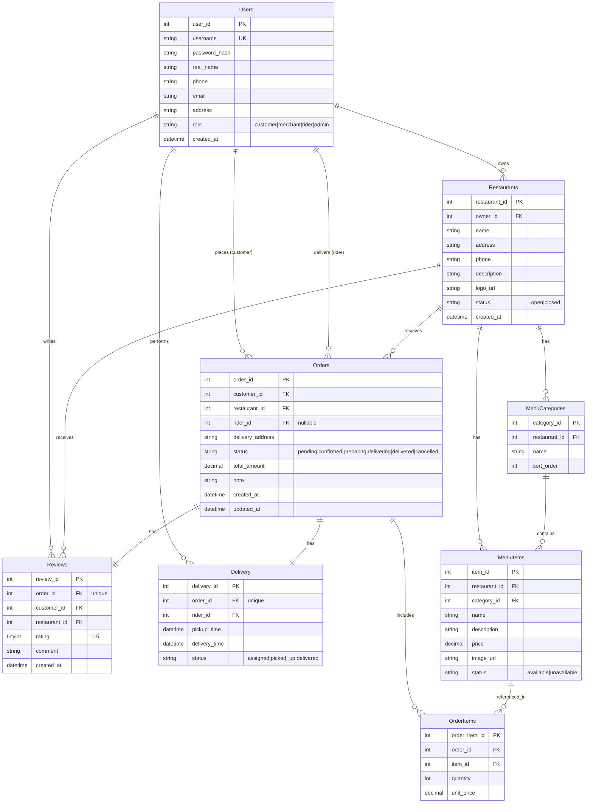

# 外卖管理系统 — E-R 图

> 使用 Mermaid 语法，可在支持 Mermaid 的 Markdown 阅读器中渲染

## 实体关系图 (ER Diagram)

## 关系描述

| 关系 | 类型 | 说明 |
|------|------|------|
| Users → Restaurants | 1:N | 一个用户（商家角色）可拥有一个店铺 |
| Users → Orders (customer) | 1:N | 一个顾客可下多个订单 |
| Users → Orders (rider) | 1:N | 一个骑手可配送多个订单 |
| Users → Reviews | 1:N | 一个顾客可写多条评价 |
| Users → Delivery | 1:N | 一个骑手可执行多个配送 |
| Restaurants → MenuCategories | 1:N | 一个商家有多个菜品分类 |
| Restaurants → MenuItems | 1:N | 一个商家有多个菜品 |
| Restaurants → Orders | 1:N | 一个商家接收多个订单 |
| Restaurants → Reviews | 1:N | 一个商家收到多条评价 |
| MenuCategories → MenuItems | 1:N | 一个分类下有多个菜品 |
| Orders → OrderItems | 1:N | 一个订单包含多个菜品明细 |
| Orders → Delivery | 1:1 | 一个订单对应一条配送记录 |
| Orders → Reviews | 1:1 | 一个订单对应一条评价 |
| MenuItems → OrderItems | 1:N | 一个菜品可出现在多个订单明细中 |

## 说明

- 所有表使用 `IDENTITY(1,1)` 自动递增主键
- 金额使用 `DECIMAL(10,2)` 保证精度
- 状态字段使用 `CHECK` 约束限制取值范围
- 关键外键建有索引以提升查询性能
