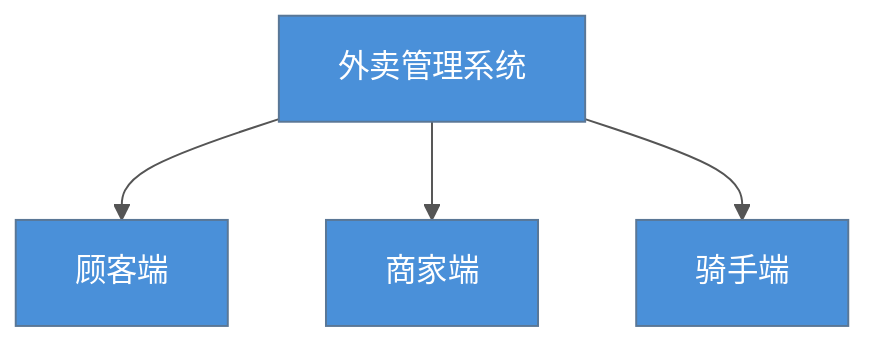
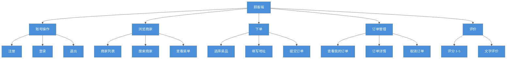
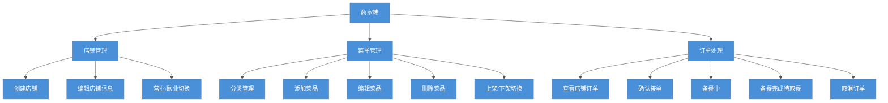
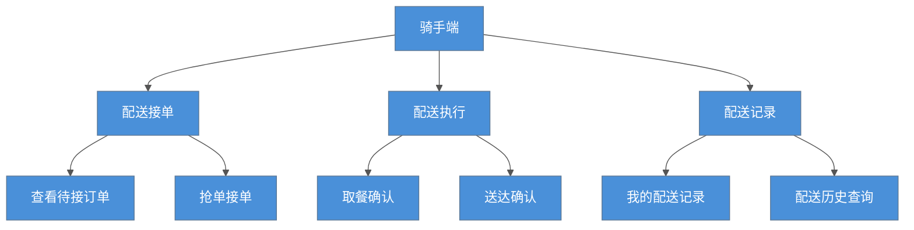
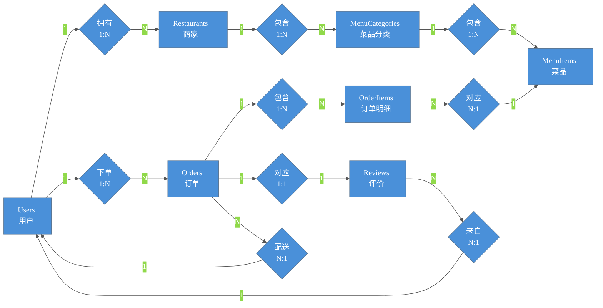

# 外卖管理系统 — 系统设计文档

---

## 一、功能结构图

### 总览



### 1.1 顾客端功能



### 1.2 商家端功能



### 1.3 骑手端功能




## 二、E-R 图 (实体关系图)



---

## 三、数据表结构

> 共 7 张表。格式说明：**PK** = 主键，**FK** = 外键，**UQ** = 唯一约束。

---

### 总览 — 表关系图

```
Users ──── 1:N ──── Restaurants ──── 1:N ──── MenuCategories ──── 1:N ──── MenuItems
  │                    │                                                         │
  │ 1:N               │ 1:N                                                     │
  ▼                    ▼                                                         │
Orders ◄───────────────┘                                                         │
  │ 1:N                                                                          │
  │      ┌──────────────────────────────────────────────────────────────────────┘
  ▼      ▼
OrderItems (订单明细，关联 MenuItems)
  │
  │ 1:1
  ▼
Reviews ◄── N:1 ── Users (评价人)
```

---

### 1. Users — 用户表

存顾客、商家、骑手三类用户，通过 `role` 字段区分。

| 列名 | 类型 | 约束 | 说明 |
|---|---|---|---|
| user_id | INT | **PK**，IDENTITY(1,1) | 用户 ID，自增 |
| username | NVARCHAR(50) | NOT NULL，**UQ** | 用户名，不可重复 |
| password_hash | NVARCHAR(255) | NOT NULL | 密码哈希（scrypt 加密存储） |
| real_name | NVARCHAR(50) | NOT NULL | 真实姓名 |
| phone | NVARCHAR(20) | NOT NULL | 手机号码 |
| address | NVARCHAR(200) | 可空 | 地址（顾客的默认送餐地址） |
| role | NVARCHAR(20) | NOT NULL，默认 `'customer'` | 角色：`customer`（顾客）/ `merchant`（商家）/ `rider`（骑手） |
| created_at | DATETIME2 | NOT NULL，默认 GETDATE() | 注册时间 |

---

### 2. Restaurants — 商家表

每个商家由一个 `merchant` 角色的用户拥有。

| 列名 | 类型 | 约束 | 说明 |
|---|---|---|---|
| restaurant_id | INT | **PK**，IDENTITY(1,1) | 店铺 ID，自增 |
| owner_id | INT | **FK** → Users.user_id，ON DELETE CASCADE | 店主（必须是 role=merchant 的用户） |
| name | NVARCHAR(100) | NOT NULL | 店铺名称 |
| address | NVARCHAR(200) | NOT NULL | 店铺地址 |
| phone | NVARCHAR(20) | NOT NULL | 店铺联系电话 |
| description | NVARCHAR(500) | 可空 | 店铺简介 |
| status | NVARCHAR(20) | NOT NULL，默认 `'open'` | 营业状态：`open`（营业中）/ `closed`（歇业） |
| created_at | DATETIME2 | NOT NULL，默认 GETDATE() | 创建时间 |

---

### 3. MenuCategories — 菜品分类表

每个商家自定义自己的菜品分类（如：招牌热菜、凉菜、主食、饮品）。

| 列名 | 类型 | 约束 | 说明 |
|---|---|---|---|
| category_id | INT | **PK**，IDENTITY(1,1) | 分类 ID，自增 |
| restaurant_id | INT | **FK** → Restaurants.restaurant_id，ON DELETE CASCADE | 所属店铺 |
| name | NVARCHAR(50) | NOT NULL | 分类名称 |
| sort_order | INT | NOT NULL，默认 0 | 排序号，越小越靠前 |

---

### 4. MenuItems — 菜品表

每道菜属于某个商家下的某个分类。

| 列名 | 类型 | 约束 | 说明 |
|---|---|---|---|
| item_id | INT | **PK**，IDENTITY(1,1) | 菜品 ID，自增 |
| restaurant_id | INT | **FK** → Restaurants.restaurant_id | 所属店铺 |
| category_id | INT | **FK** → MenuCategories.category_id，ON DELETE CASCADE | 所属分类 |
| name | NVARCHAR(100) | NOT NULL | 菜品名称 |
| description | NVARCHAR(500) | 可空 | 菜品描述 |
| price | DECIMAL(10,2) | NOT NULL，CHECK ≥ 0 | 单价 |
| status | NVARCHAR(20) | NOT NULL，默认 `'available'` | `available`（上架）/ `unavailable`（下架） |

---

### 5. Orders — 订单表

核心业务表。记录了顾客下单、商家接单、骑手配送的完整链路。

| 列名 | 类型 | 约束 | 说明 |
|---|---|---|---|
| order_id | INT | **PK**，IDENTITY(1,1) | 订单 ID，自增 |
| customer_id | INT | **FK** → Users.user_id | 下单顾客 |
| restaurant_id | INT | **FK** → Restaurants.restaurant_id | 接单商家 |
| rider_id | INT | **FK** → Users.user_id，可空 | 配送骑手（配送前为 NULL，骑手接单后填入） |
| delivery_address | NVARCHAR(200) | NOT NULL | 配送地址 |
| status | NVARCHAR(20) | NOT NULL，CHECK 约束 8 种状态，默认 `'pending'` | 订单当前状态 |
| total_amount | DECIMAL(10,2) | NOT NULL，CHECK ≥ 0，默认 0 | 订单总金额 = 菜品合计 + 配送费 |
| delivery_fee | DECIMAL(10,2) | NOT NULL，CHECK ≥ 0，默认 5.00 | 配送费 |
| note | NVARCHAR(500) | 可空 | 订单备注（少放辣、不要糖等） |
| pickup_time | DATETIME2 | 可空 | 骑手取餐时间 |
| delivery_time | DATETIME2 | 可空 | 骑手送达时间 |
| created_at | DATETIME2 | NOT NULL，默认 GETDATE() | 下单时间 |

---

### 6. OrderItems — 订单明细表

一个订单可以包含多道菜品，每道菜单独一条记录。`unit_price` 是下单时的快照价格。

| 列名 | 类型 | 约束 | 说明 |
|---|---|---|---|
| order_item_id | INT | **PK**，IDENTITY(1,1) | 明细 ID，自增 |
| order_id | INT | **FK** → Orders.order_id，ON DELETE CASCADE | 所属订单 |
| item_id | INT | **FK** → MenuItems.item_id | 菜品 ID |
| quantity | INT | NOT NULL，CHECK > 0 | 数量 |
| unit_price | DECIMAL(10,2) | NOT NULL，CHECK ≥ 0 | 下单时的菜品单价（快照，不随后续菜品改价而变化） |

---

### 7. Reviews — 评价表

一个订单只能评价一次（UQ on order_id），评分 1-5 分。

| 列名 | 类型 | 约束 | 说明 |
|---|---|---|---|
| review_id | INT | **PK**，IDENTITY(1,1) | 评价 ID，自增 |
| order_id | INT | **FK** → Orders.order_id，ON DELETE CASCADE，**UQ** | 评价的订单（一个订单只能评价一次） |
| customer_id | INT | **FK** → Users.user_id | 评价人（下单顾客） |
| rating | SMALLINT | NOT NULL，CHECK 1~5 | 评分，1-5 分 |
| comment | NVARCHAR(500) | 可空 | 文字评价 |
| created_at | DATETIME2 | NOT NULL，默认 GETDATE() | 评价时间 |

---

## 四、索引设计策略

### 4.1 设计原则

| 原则 | 说明 |
|------|------|
| **外键必建索引** | 所有 FK 列均建有非聚集索引，保证 JOIN 和参照完整性检查的效率 |
| **筛选列建索引** | `role`、`status` 等高频出现在 `WHERE` 子句的列建有索引 |
| **OLTP 优先** | 以支持高频短事务为主；复合索引暂未引入，避免写入放大 |
| **基数不歧视** | 低基数列（如 `status` 仅 2~8 个值）依然建索引 —— 因为查询总是带 `WHERE status = '...'` 条件 |

### 4.2 索引清单

| 表 | 索引名 | 索引列 | 类型 | 对应的典型查询 |
|----|-------|--------|------|--------------|
| Users | `IX_Users_Role` | `role` | 非聚集 | 按角色筛选用户 |
| Restaurants | `IX_Restaurants_Status` | `status` | 非聚集 | 顾客浏览营业中商家：`WHERE status = 'open'` |
| Restaurants | `IX_Restaurants_Owner` | `owner_id` | 非聚集 | 商家查找自己的店铺：`WHERE owner_id = ?` |
| MenuCategories | `IX_Categories_Restaurant` | `restaurant_id` | 非聚集 | 加载商家菜单分类：`WHERE restaurant_id = ?` |
| MenuItems | `IX_Items_Restaurant` | `restaurant_id` | 非聚集 | 加载商家菜品列表：`WHERE restaurant_id = ?` |
| MenuItems | `IX_Items_Category` | `category_id` | 非聚集 | 按分类加载菜品：`WHERE category_id = ?` |
| MenuItems | `IX_Items_Status` | `status` | 非聚集 | 仅展示上架菜品：`WHERE status = 'available'` |
| Orders | `IX_Orders_Customer` | `customer_id` | 非聚集 | 顾客查看"我的订单"：`WHERE customer_id = ?` |
| Orders | `IX_Orders_Restaurant` | `restaurant_id` | 非聚集 | 商家查看"本店订单"：`WHERE restaurant_id = ?` |
| Orders | `IX_Orders_Rider` | `rider_id` | 非聚集 | 骑手查看"我的配送"：`WHERE rider_id = ?` |
| Orders | `IX_Orders_Status` | `status` | 非聚集 | 按状态筛选；骑手查看待接订单：`WHERE status = 'ready'` |
| OrderItems | `IX_OrderItems_Order` | `order_id` | 非聚集 | 加载订单明细：`WHERE order_id = ?` |
| Reviews | `IX_Reviews_Order` | `order_id` | 非聚集 | 按订单查评价：`WHERE order_id = ?`（也由 UNIQUE 约束保障） |

> **共计 13 个索引**。主键（`*_id`）均由 `PRIMARY KEY` 自动创建聚集索引，不在表中重复列出。

### 4.3 主要查询路径与索引命中

| 查询场景 | 对应路由 | 索引路径 | 备注 |
|---------|---------|---------|------|
| 顾客浏览商家列表 | `restaurant/list_restaurants()` | `IX_Restaurants_Status` | `WHERE status='open'`，全表扫描过滤关键字 |
| 加载商家菜单 | `restaurant/detail(id)` | `IX_Categories_Restaurant` + `IX_Items_Category` + `IX_Items_Status` | 两级加载：分类 → 菜品（仅 `available`） |
| 顾客查看订单 | `order/my_orders()` (customer) | `IX_Orders_Customer` + `IX_Orders_Status` | 按 `customer_id` 过滤，可选按状态分组 |
| 商家查看订单 | `order/my_orders()` (merchant) | `IX_Orders_Restaurant` + `IX_Orders_Status` | 先查 Restaurant → 再查 Orders |
| 骑手查看待接订单 | `delivery/available_orders()` | `IX_Orders_Status` + `IX_Orders_Rider` | `WHERE status='ready' AND rider_id IS NULL` |
| 骑手查看配送记录 | `delivery/my_deliveries()` | `IX_Orders_Rider` + `IX_Orders_Status` | `WHERE rider_id=? AND status IN (...)` |
| 订单详情 + 明细 | `order/detail(id)` | PK(Orders) + `IX_OrderItems_Order` | 主键点查 + FK 索引 JOIN |
| 提交评价 | `order/review(id)` | PK(Orders) + `IX_Reviews_Order` | 先查订单 → 再查/写评价 |

---

