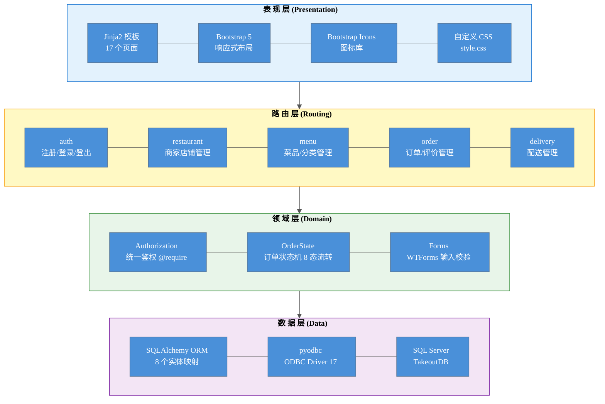
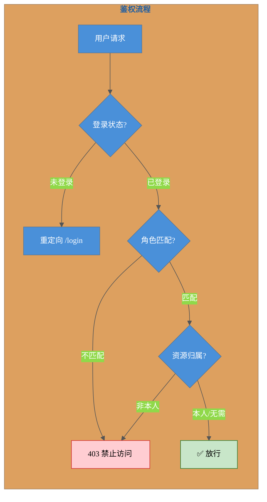
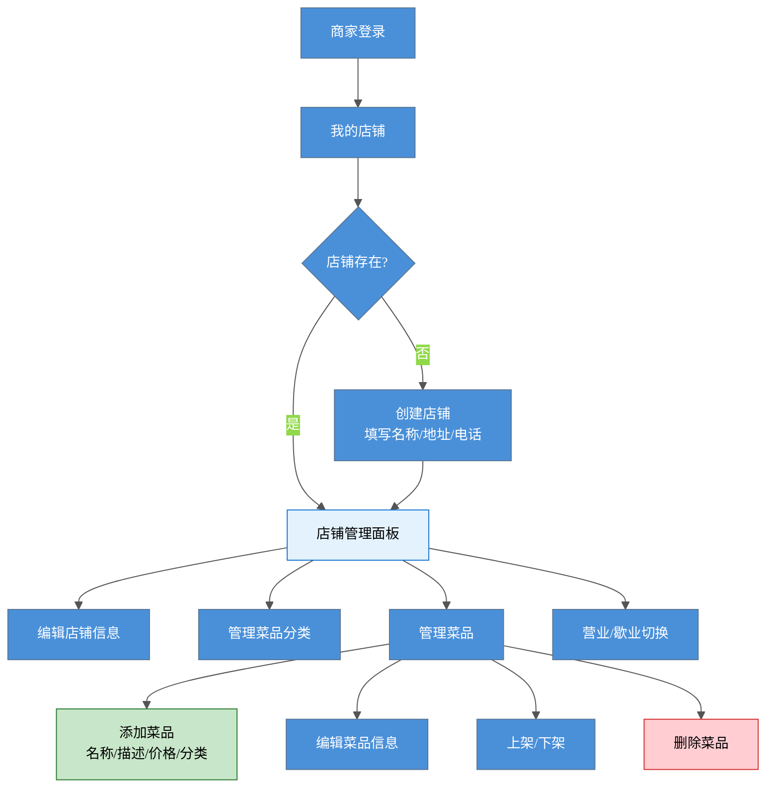
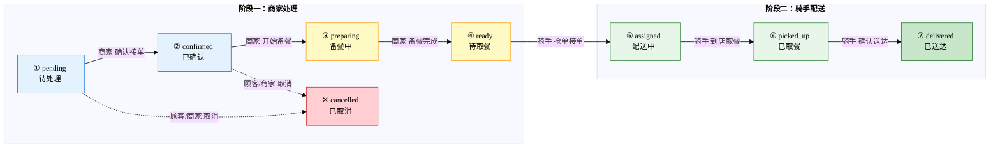
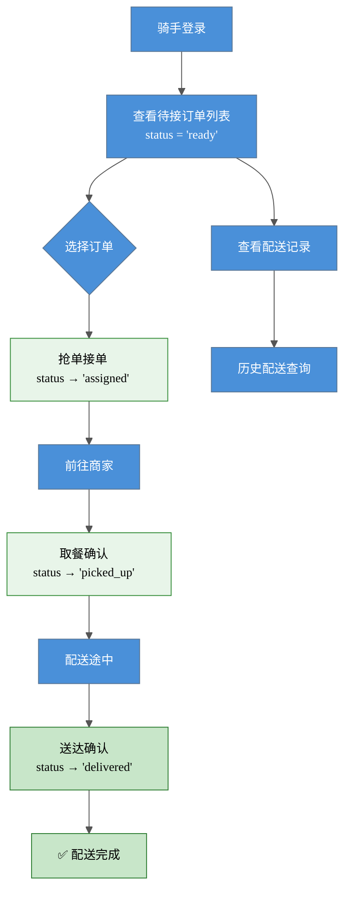
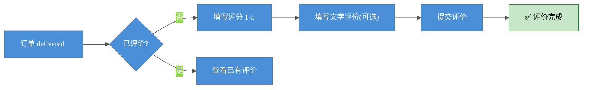
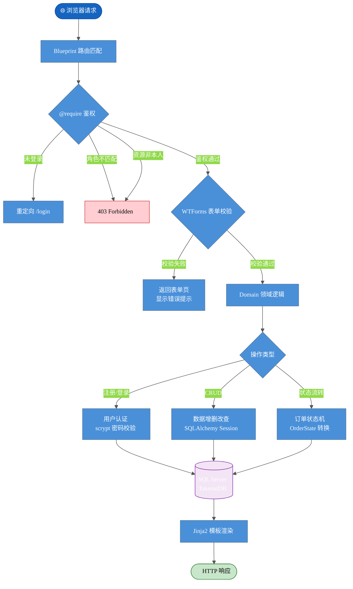
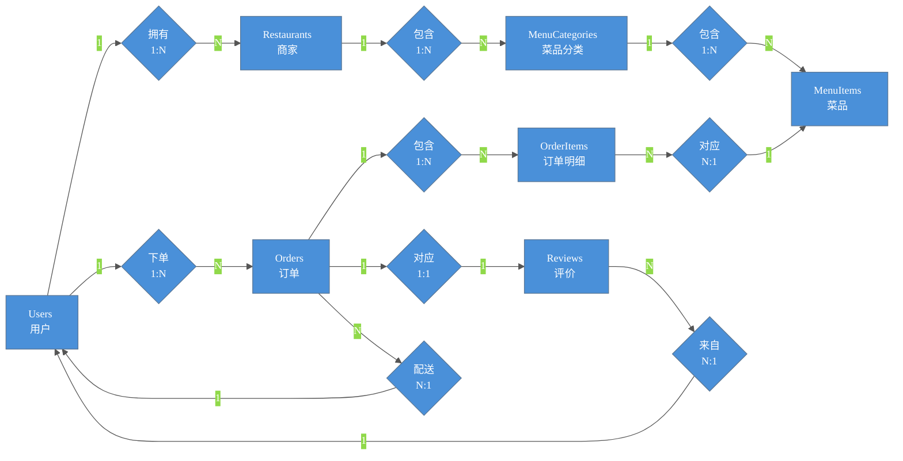

# 外卖管理系统 — 软件功能总体设计

---

## 一、系统总体层次方框图

系统采用 **分层架构**，自顶向下分为 4 层：**表现层 → 路由层 → 领域层 → 数据层**。

> **图例**：🔵 表现层 — HTML 模板 + Bootstrap 5 前端　🟡 路由层 — Flask Blueprint 5 模块　🟢 领域层 — 鉴权 / 状态机 / 表单校验　🟣 数据层 — ORM → ODBC → SQL Server

### 层次职责说明

| 层次 | 技术 | 职责 | 关键约束 |
|------|------|------|----------|
| **表现层** | Jinja2 + Bootstrap 5 | 页面渲染、用户交互 | 不包含业务逻辑，只做展示与表单 |
| **路由层** | Flask Blueprint (5 模块) | HTTP 适配：解析请求 → 调用领域 → 渲染响应 | 不写业务代码，只做参数提取与调用转发 |
| **领域层** | Python 纯函数 + 类 | 鉴权校验、订单状态流转、表单规则 | 与 Flask 解耦，可脱离 HTTP 独立测试 |
| **数据层** | SQLAlchemy + pyodbc | 实体映射、查询执行、事务管理 | 7 表 + 1 查找表，13 个辅助索引 |

---

## 二、软件主要功能介绍

### 2.1 用户管理 — 统一认证体系

三种角色（顾客、商家、骑手）共用同一套注册/登录界面，通过 `role` 字段区分身份。

**角色权限矩阵：**

| 功能 | 顾客 | 商家 | 骑手 |
|------|:---:|:---:|:---:|
| 浏览商家/菜单 | ✅ | — | — |
| 下单 | ✅ | — | — |
| 管理店铺 | — | ✅ | — |
| 管理菜品 | — | ✅ | — |
| 处理订单（接单/备餐） | — | ✅ | — |
| 配送接单 | — | — | ✅ |
| 标记取餐/送达 | — | — | ✅ |
| 查看我的订单 | ✅ | ✅ | ✅ |
| 评价 | ✅ | — | — |

> 鉴权由 `app/domain/auth.py` 中的 `@require(role=..., owns=...)` 装饰器统一处理，一次声明即完成：登录检查 → 角色校验 → 资源所有权验证。

---

### 2.2 商家管理 — 店铺与菜单维护

商家可以创建和编辑自己的店铺，管理菜品分类和菜品。

---

### 2.3 订单管理 — 核心业务流程

订单是整个系统的核心，贯穿顾客、商家、骑手三方的协作。

**订单 8 种状态：**

| 阶段 | 状态 | 中文名 | 操作角色 |
|------|------|--------|----------|
| 阶段一 | `pending` | 待处理 | 顾客已提交 |
| 阶段一 | `confirmed` | 已确认 | 商家确认接单 |
| 阶段一 | `preparing` | 备餐中 | 商家开始制作 |
| 交接点 | `ready` | 待取餐 | 商家备好，等骑手 |
| 阶段二 | `assigned` | 配送中 | 骑手已接单 |
| 阶段二 | `picked_up` | 已取餐 | 骑手取餐完成 |
| 终态 | `delivered` | 已送达 | ✅ 完成 |
| 终态 | `cancelled` | 已取消 | 🚫 终止 |

**完整订单状态流转图：**

> 实线 = 正常流转　虚线 = 取消（旁路）　`preparing` 之后不可取消（防止食物浪费）　`delivered` / `cancelled` 为终态，不可再向后流转。

---

### 2.4 配送管理 — 骑手工作流

骑手独立的功能闭环：发现待接订单 → 接单 → 取餐 → 送达。

---

### 2.5 评价系统

顾客在订单完成后可对订单进行 1-5 分评分和文字评价。一个订单只能评价一次（`order_id` 唯一约束）。

---

## 三、程序总体流程图

以下为系统的 **主控制流**：从用户请求到响应的完整路径。

---

## 四、数据库模型图

系统共 **7 张业务表**，实体关系如下：

---

> 