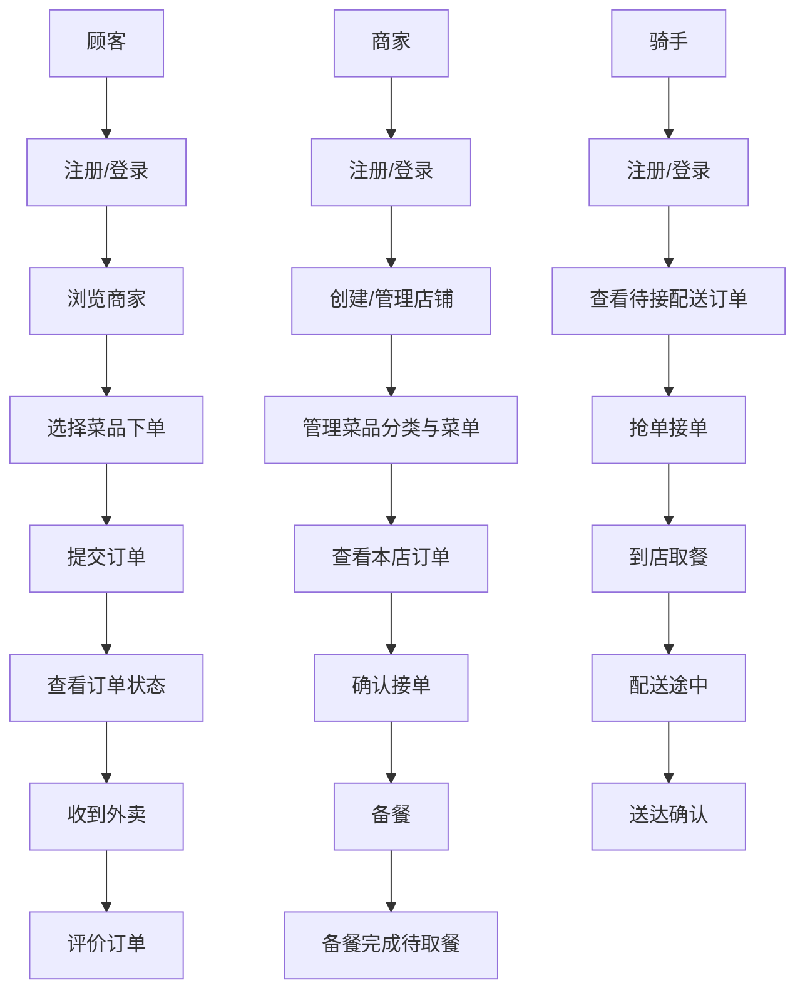
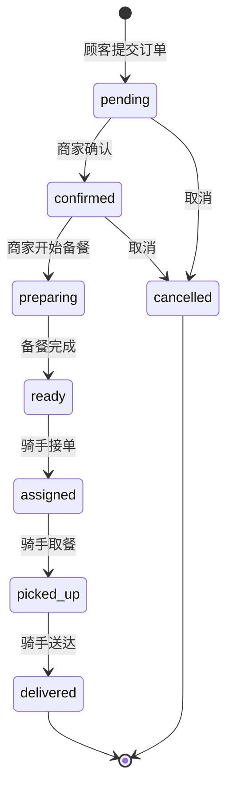
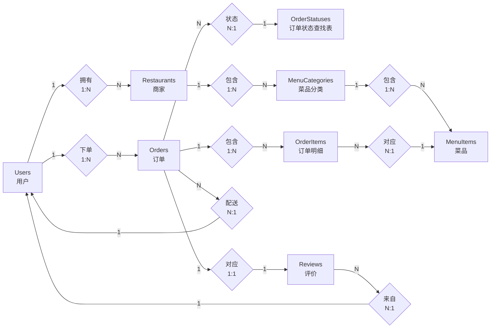
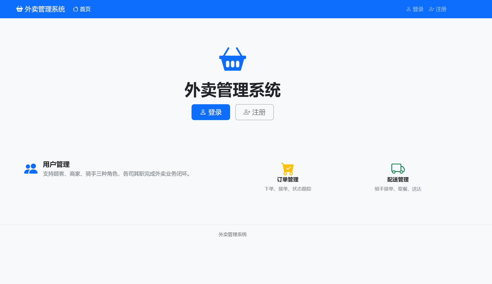
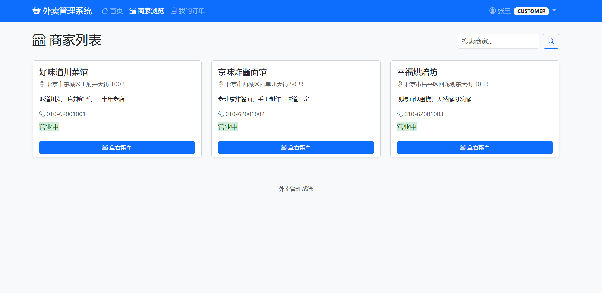
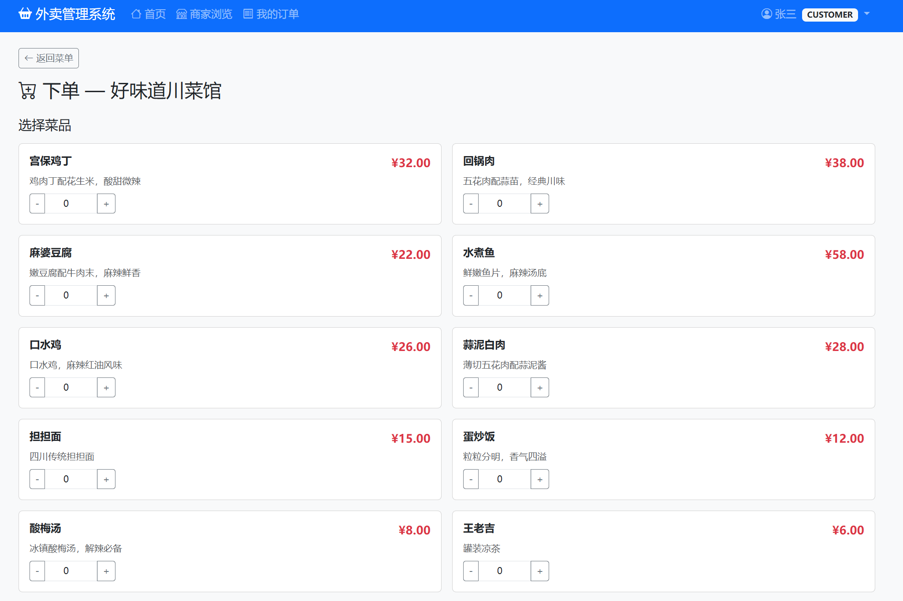
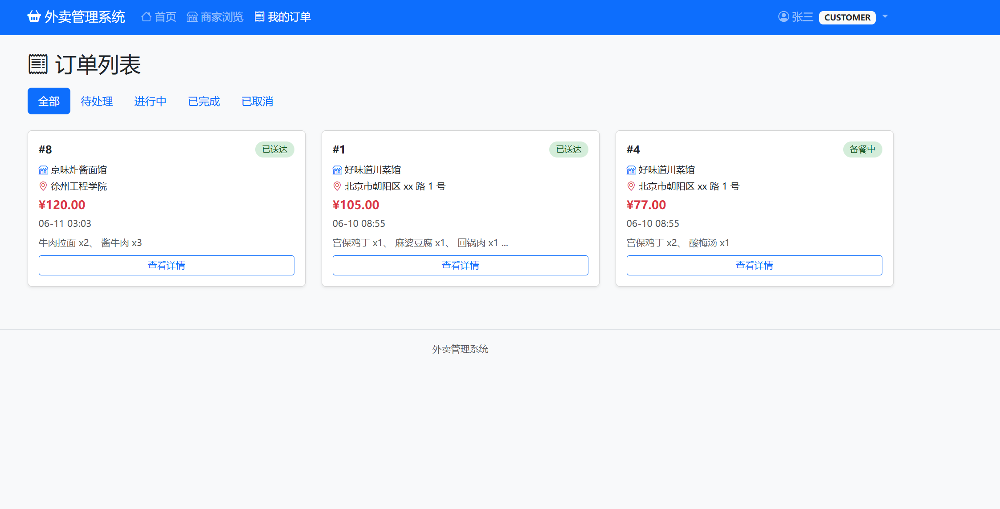
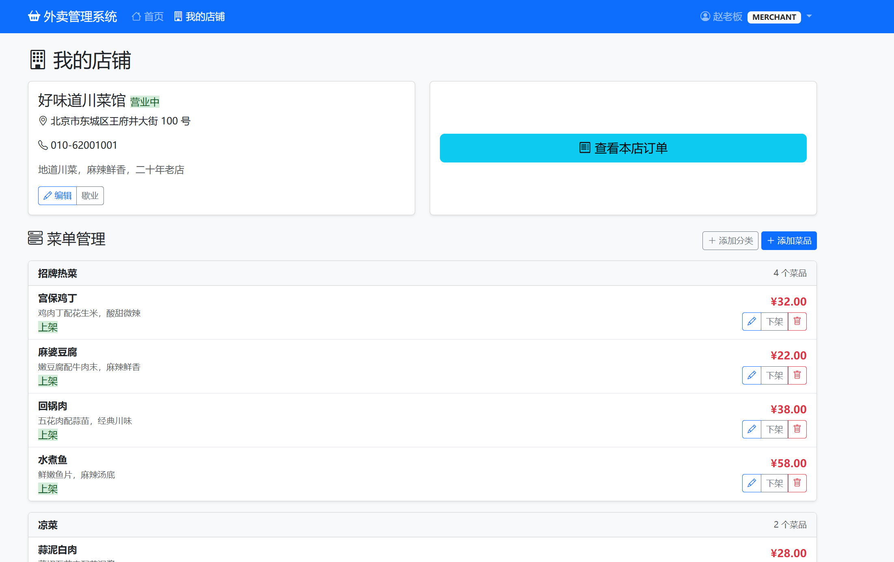
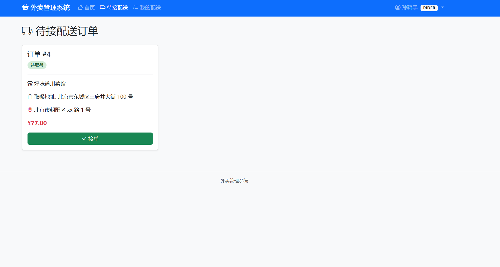
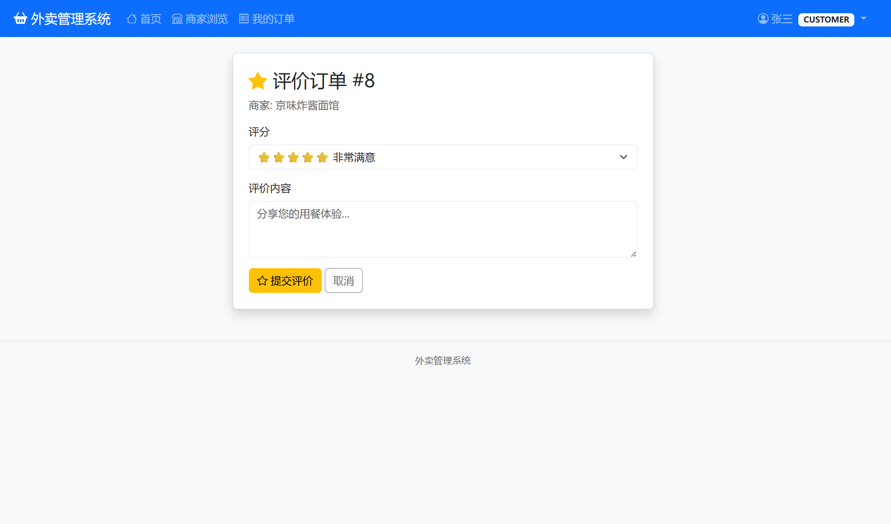

# 外卖管理系统 — 实验报告

---

## 一、项目说明（摘要）

外卖管理系统是一个基于 **Flask + SQL Server** 的 Web 应用，完整实现了外卖业务的核心流程。系统支持三种角色——**顾客**（浏览商家、下单、评价）、**商家**（管理店铺与菜品、处理订单）、**骑手**（接单、取餐、送达）——各司其职形成业务闭环。

项目在设计上采用了 **领域驱动设计（DDD）** 思想，将订单生命周期建模为独立的状态机模块（`OrderState`），将权限检查抽象为统一的授权门面（`Authorization`），以"深模块、窄接口"的原则组织代码，使核心逻辑高度内聚、调用方极简。前端采用 **Bootstrap 5** 响应式布局，交互友好的动态购物车通过原生 JavaScript 实现。

**技术栈总结**：

| 层次 | 技术选型 |
|------|----------|
| 后端框架 | Flask 3.x (Python) |
| ORM | SQLAlchemy 2.x + Flask-SQLAlchemy |
| 数据库 | SQL Server (通过 pyodbc + ODBC Driver 17) |
| 表单验证 | WTForms + Flask-WTF |
| 密码加密 | Werkzeug scrypt |
| 前端框架 | Bootstrap 5.3 + Bootstrap Icons |
| 模板引擎 | Jinja2 |
| 架构模式 | 领域驱动设计 (Deep Modules) |

---

## 二、环境配置

### 2.1 硬件环境

- 操作系统：Windows 10/11（64 位）
- CPU：Intel Core i5 及以上
- 内存：8 GB 及以上
- 硬盘：预留 500 MB 可用空间

### 2.2 软件环境

| 软件 | 版本要求 | 说明 |
|------|----------|------|
| Python | 3.10+ | 后端开发语言 |
| SQL Server | 2017+ | 关系型数据库 |
| ODBC Driver | 17 for SQL Server | 数据库连接驱动 |
| Conda / venv | 任意版本 | Python 虚拟环境管理 |

### 2.3 环境搭建步骤

**步骤一：创建虚拟环境并激活**

```bash
conda create -n takeout python=3.10 -y
conda activate takeout
```

**步骤二：安装依赖包**

```bash
pip install -r requirements.txt
```

`requirements.txt` 内容如下：

```
Flask>=3.0
Flask-SQLAlchemy>=3.0
Flask-WTF>=1.2
pyodbc>=5.0
SQLAlchemy>=2.0
Werkzeug>=3.0
```

**步骤三：配置数据库**

在 SQL Server 中创建数据库 `TakeoutDB`，并确保 Windows 身份验证可用。数据库连接字符串在 `app/config.py` 中配置：

```python
SQLALCHEMY_DATABASE_URI = (
    'mssql+pyodbc://./TakeoutDB'
    '?driver=ODBC+Driver+17+for+SQL+Server'
    '&trusted_connection=yes'
    '&TrustServerCertificate=yes'
)
```

**步骤四：初始化数据表**

首次运行时，在 Python 交互环境中执行建表操作：

```python
from app import create_app
from app.models import db

app = create_app()
with app.app_context():
    db.create_all()
```

**步骤五：启动应用**

```bash
python run.py
```

浏览器访问 `http://127.0.0.1:5000` 即可进入系统。

---

## 三、总体设计

### 3.1 系统流程图



**业务流程概述**：

1. **顾客**注册/登录 → 浏览营业中的商家 → 查看菜品菜单 → 选择菜品加入购物车 → 填写配送地址 → 提交订单
2. **商家**查看本店订单 → 确认接单 → 备餐 → 备餐完成等待骑手取餐
3. **骑手**查看待接配送订单 → 抢单接单 → 到店取餐 → 送达确认
4. **顾客**收到外卖后对订单进行评分和评价（1-5 星）

**订单状态流转图**：



### 3.2 数据库设计

系统共设计 **8 张数据表**，完整覆盖用户、商家、菜单、订单、评价等核心实体。

#### 3.2.1 E-R 图（实体关系图）



#### 3.2.2 核心数据表说明

**（1）Users — 用户表**

存储顾客、商家、骑手三类用户，通过 `role` 字段区分。

| 列名 | 类型 | 约束 | 说明 |
|------|------|------|------|
| user_id | INT | PK, IDENTITY | 用户 ID |
| username | NVARCHAR(50) | NOT NULL, UQ | 用户名 |
| password_hash | NVARCHAR(255) | NOT NULL | 密码哈希 (scrypt) |
| real_name | NVARCHAR(50) | NOT NULL | 真实姓名 |
| phone | NVARCHAR(20) | NOT NULL | 手机号码 |
| email | NVARCHAR(100) | 可空 | 电子邮箱 |
| address | NVARCHAR(200) | 可空 | 默认送餐地址 |
| role | NVARCHAR(20) | NOT NULL | customer / merchant / rider |
| created_at | DATETIME2 | NOT NULL | 注册时间 |

**（2）Restaurants — 商家表**

| 列名 | 类型 | 约束 | 说明 |
|------|------|------|------|
| restaurant_id | INT | PK, IDENTITY | 店铺 ID |
| owner_id | INT | FK → Users | 店主 |
| name | NVARCHAR(100) | NOT NULL | 店铺名称 |
| address | NVARCHAR(200) | NOT NULL | 店铺地址 |
| phone | NVARCHAR(20) | NOT NULL | 联系电话 |
| description | NVARCHAR(500) | 可空 | 店铺简介 |
| status | NVARCHAR(20) | NOT NULL | open / closed |

**（3）Orders — 订单表（核心业务表）**

| 列名 | 类型 | 约束 | 说明 |
|------|------|------|------|
| order_id | INT | PK, IDENTITY | 订单 ID |
| customer_id | INT | FK → Users | 下单顾客 |
| restaurant_id | INT | FK → Restaurants | 接单商家 |
| rider_id | INT | FK → Users, 可空 | 配送骑手 |
| delivery_address | NVARCHAR(200) | NOT NULL | 配送地址 |
| status | NVARCHAR(20) | FK → OrderStatuses | 订单状态 |
| total_amount | DECIMAL(10,2) | NOT NULL | 订单总金额 |
| delivery_fee | DECIMAL(10,2) | NOT NULL | 配送费 (固定 ¥5.00) |
| note | NVARCHAR(500) | 可空 | 订单备注 |
| pickup_time | DATETIME2 | 可空 | 骑手取餐时间 |
| delivery_time | DATETIME2 | 可空 | 骑手送达时间 |
| created_at | DATETIME2 | NOT NULL | 下单时间 |

**（4）OrderItems — 订单明细表**

| 列名 | 类型 | 约束 | 说明 |
|------|------|------|------|
| order_item_id | INT | PK, IDENTITY | 明细 ID |
| order_id | INT | FK → Orders | 所属订单 |
| item_id | INT | FK → MenuItems | 菜品 ID |
| quantity | INT | NOT NULL, >0 | 数量 |
| unit_price | DECIMAL(10,2) | NOT NULL | 下单时单价快照 |

**（5）Reviews — 评价表**

| 列名 | 类型 | 约束 | 说明 |
|------|------|------|------|
| review_id | INT | PK, IDENTITY | 评价 ID |
| order_id | INT | FK → Orders, UQ | 一个订单只能评价一次 |
| customer_id | INT | FK → Users | 评价人 |
| rating | TINYINT | NOT NULL, 1~5 | 评分 |
| comment | NVARCHAR(500) | 可空 | 文字评价 |

**（6）MenuCategories — 菜品分类表**

每个商家自定义自己的菜品分类（如：招牌热菜、凉菜、主食、饮品）。

| 列名 | 类型 | 约束 | 说明 |
|------|------|------|------|
| category_id | INT | PK, IDENTITY | 分类 ID |
| restaurant_id | INT | FK → Restaurants, ON DELETE CASCADE | 所属店铺 |
| name | NVARCHAR(50) | NOT NULL | 分类名称 |
| sort_order | INT | NOT NULL, 默认 0 | 排序号，越小越靠前 |
| updated_at | DATETIME2 | NOT NULL | 最后更新时间 |

**（7）MenuItems — 菜品表**

每道菜属于某个商家下的某个分类，支持上下架切换。

| 列名 | 类型 | 约束 | 说明 |
|------|------|------|------|
| item_id | INT | PK, IDENTITY | 菜品 ID |
| restaurant_id | INT | FK → Restaurants | 所属店铺 |
| category_id | INT | FK → MenuCategories | 所属分类 |
| name | NVARCHAR(100) | NOT NULL | 菜品名称 |
| description | NVARCHAR(500) | 可空 | 菜品描述 |
| price | DECIMAL(10,2) | NOT NULL, CHECK ≥ 0 | 单价 |
| image_url | NVARCHAR(255) | 可空 | 菜品图片 URL |
| status | NVARCHAR(20) | NOT NULL, 默认 available | available（上架）/ unavailable（下架） |
| updated_at | DATETIME2 | NOT NULL | 最后更新时间 |

**（8）OrderStatuses — 订单状态查找表**

定义订单的所有合法状态及流转顺序。

| 列名 | 类型 | 约束 | 说明 |
|------|------|------|------|
| status_code | NVARCHAR(20) | PK | pending / confirmed / preparing / ready / assigned / picked_up / delivered / cancelled |
| display_name | NVARCHAR(50) | NOT NULL | 中文显示：待处理 / 已确认 / 备餐中 / 待取餐 / 配送中 / 已取餐 / 已送达 / 已取消 |
| sequence | INT | NOT NULL | 排序序号 |
| is_terminal | BIT | NOT NULL, 默认 0 | 是否终态（delivered、cancelled 为终态） |

---

## 四、算法设计 — 大模型辅助的代码创新与优化

本项目在算法和架构设计层面，利用大语言模型（Claude）进行了以下创新优化，体现了"AI 辅助软件工程"的实践思路。

### 4.1 订单状态机（OrderState）— 领域驱动的深模块设计

**创新点**：将原本分散在多个路由文件中的订单状态判断逻辑，抽象为独立的 **有限状态机（FSM）** 模块。

传统做法通常是在每个路由处理函数中硬编码状态转换逻辑，例如：

```python
# 传统写法（散落在各个路由中）
if order.status == 'pending':
    order.status = 'confirmed'
elif order.status == 'confirmed':
    if action == 'prepare':
        order.status = 'preparing'
    elif action == 'cancel':
        order.status = 'cancelled'
# ... 大量重复的条件判断
```

**改进后的设计**：将所有状态转换规则、角色守卫、资源所有权检查统一收敛到一个 `OrderState` 类中，以 **字典驱动 + 声明式守卫** 的方式实现。

```python
class OrderState:
    # 状态转换表（声明式、可审查）
    TRANSITIONS = {
        ('pending',   'confirm'): 'confirmed',
        ('pending',   'cancel'):  'cancelled',
        ('confirmed', 'prepare'): 'preparing',
        # ...
    }

    # 角色守卫（谁有权执行什么操作）
    ROLE_GUARDS = {
        'confirm': {'merchant'},
        'cancel':  {'customer', 'merchant'},
        'assign':  {'rider'},
        'pickup':  {'rider'},
        'deliver': {'rider'},
    }

    @classmethod
    def transition(cls, order, action, actor):
        # 统一的验证入口：角色检查 + 状态转换检查 + 所有权检查
        ...
```

**优化效果**：
- **调用方极简**：路由函数只需一行 `OrderState.transition(order, action, actor)` 即可完成所有校验
- **可测试性强**：状态机是纯逻辑，不依赖 Flask 请求上下文，可独立编写单元测试
- **可维护性高**：新增状态或修改流转规则只需修改 `TRANSITIONS` 字典，无需改动业务路由代码

### 4.2 统一授权门面（Authorization）— 消除横切关注点重复

**创新点**：将散落在 4 个路由文件中的 `@login_required + @role_required + 内联所有权查询` 模式，重构为 **单一装饰器 `@require()`**，并实现资源所有权的自动解析与注入。

**传统写法的问题**：

```python
# 每个受保护的路由都需要重复这种模式
@login_required
@role_required('merchant')
def edit():
    restaurant = Restaurant.query.filter_by(owner_id=session['user_id']).first()
    if not restaurant:
        flash('请先创建店铺')
        return redirect(...)
    # ... 业务逻辑
```

**改进后**：

```python
@require(role='merchant', owns='restaurant')
def edit():
    restaurant = g.current_restaurant  # 自动注入，无需重复查询
    # ... 业务逻辑
```

**优化效果**：
- 路由文件代码量减少约 40%
- 权限逻辑集中管理，修改一处即可全局生效
- `g.current_restaurant` 自动注入消除了重复的数据库查询

### 4.3 订单与配送表合并 — 数据库模式简化

**创新点**：原设计将配送信息独立为 `Delivery` 表，经分析发现配送与订单是 1:1 关系且始终同时操作，因此将 `rider_id`、`pickup_time`、`delivery_time` 直接合并到 `Orders` 表中。

**优化效果**：
- 减少一张表和关联查询的 JOIN 开销
- 订单详情查询从 2 次数据库访问减少为 1 次
- 保证了配送数据与订单状态的事务一致性

### 4.4 前端动态购物车 — 原生 JS 实现

**创新点**：下单页面的购物车采用纯原生 JavaScript 实现，不依赖任何前端框架。用户通过 `+/-` 按钮实时调整菜品数量，购物车数据以 JSON 形式存储，提交时通过隐藏字段传递。

```javascript
// 核心逻辑：实时更新购物车和总价
function updateCart() {
    let subtotal = 0;
    document.querySelectorAll('.item-qty').forEach(input => {
        const qty = parseInt(input.value) || 0;
        const price = parseFloat(input.dataset.price);
        if (qty > 0) {
            cart[id] = qty;
            subtotal += qty * price;
        }
    });
    const total = subtotal + DELIVERY_FEE;
    totalEl.textContent = total.toFixed(2);
    cartDataEl.value = JSON.stringify(cart);  // 序列化为 JSON 提交
}
```

**优化效果**：
- 零外部依赖，页面加载速度快
- 实时计算总价，用户体验流畅
- `unit_price` 快照机制保证下单价格不受后续菜品改价影响

---

## 五、详细设计

### 5.1 前端设计

#### 5.1.1 前端架构

```
app/templates/
├── base.html                          # 基础模板（导航栏 + 页脚 + Bootstrap CDN）
├── index.html                         # 首页（角色自适应入口）
├── auth/
│   ├── login.html                     # 登录页
│   └── register.html                  # 注册页
├── restaurant/
│   ├── list.html                      # 商家列表（支持关键词搜索）
│   ├── detail.html                    # 商家详情 + 菜单展示
│   ├── create.html                    # 创建店铺
│   ├── edit.html                      # 编辑店铺信息
│   ├── my.html                        # 我的店铺（商家管理面板）
│   └── category_form.html             # 菜品分类表单
├── menu/
│   └── form.html                      # 菜品添加/编辑表单
├── order/
│   ├── create.html                    # 下单页（动态购物车）
│   ├── list.html                      # 订单列表（状态标签筛选）
│   ├── detail.html                    # 订单详情 + 操作按钮
│   └── review.html                    # 评价表单
└── delivery/
    ├── available.html                 # 待接配送列表
    └── my.html                        # 我的配送记录
```

#### 5.1.2 前端技术特点

- **响应式布局**：基于 Bootstrap 5 栅格系统，适配桌面端和移动端
- **Bootstrap Icons**：统一图标风格，提升界面美观度
- **Flash 消息**：操作结果以彩色提示条（success / warning / danger / info）浮层展示，支持手动关闭
- **表单验证**：前端 WTForms 渲染 + 后端 DataRequired 校验双重保障
- **状态标签**：订单状态使用不同颜色的标签区分（Bootstrap badge 组件）

### 5.2 后端设计

#### 5.2.1 后端架构

```
app/
├── __init__.py              # Flask 应用工厂 + 蓝图注册 + 全局上下文注入
├── config.py                # 配置类（数据库连接、密钥、配送费）
├── forms.py                 # WTForms 表单定义（7 个表单类）
├── models/
│   ├── __init__.py          # 模型导出
│   └── models.py            # 8 个 SQLAlchemy 实体模型
├── domain/
│   ├── __init__.py          # 领域模块导出
│   ├── auth.py              # 统一授权装饰器 @require()
│   └── order_state.py       # 订单状态机 OrderState
└── routes/
    ├── __init__.py          # 蓝图包
    ├── auth.py              # 用户认证路由（注册 / 登录 / 退出）
    ├── restaurant.py        # 商家路由（店铺 CRUD / 分类管理）
    ├── menu.py              # 菜单路由（菜品 CRUD / 上下架）
    ├── order.py             # 订单路由（下单 / 列表 / 详情 / 状态流转 / 评价）
    └── delivery.py          # 配送路由（待接订单 / 接单 / 取餐 / 送达）

run.py                       # 应用启动入口
```

#### 5.2.2 核心模块说明

**（1）应用工厂 (`app/__init__.py`)**

```python
def create_app(config_class=DevelopmentConfig):
    app = Flask(__name__)
    app.config.from_object(config_class)
    db.init_app(app)

    # 注册 5 个蓝图
    app.register_blueprint(auth_bp,       url_prefix='/auth')
    app.register_blueprint(restaurant_bp, url_prefix='/restaurant')
    app.register_blueprint(menu_bp,       url_prefix='/menu')
    app.register_blueprint(order_bp,      url_prefix='/order')
    app.register_blueprint(delivery_bp,   url_prefix='/delivery')

    # 全局上下文处理器 → 注入 current_user 到所有模板
    @app.context_processor
    def inject_user():
        ...

    return app
```

**（2）数据模型 (`app/models/models.py`)**

8 个 SQLAlchemy 实体类，完整定义了表结构、约束、索引和关系映射：
- 所有外键使用 `ON DELETE CASCADE` 保证引用完整性
- 关键字段设置 `CheckConstraint`（如价格 ≥ 0、评分 1-5、状态枚举值）
- 高频查询字段（role、status、restaurant_id）设置了索引

**（3）订单状态机 (`app/domain/order_state.py`)**

核心设计见第四章 4.1 节。它是整个系统最关键的领域模块，封装了：
- 8 个订单状态的合法转换规则
- 7 种操作的执行权限（角色守卫）
- 商家所有权、顾客所有权、骑手所有权的校验
- 配送相关操作的副作用触发标识

**（4）统一授权 (`app/domain/auth.py`)**

核心设计见第四章 4.2 节。`@require(role=..., owns=...)` 装饰器实现了：
- 登录状态检查
- 角色权限检查
- 资源所有权自动解析与注入（`g.current_restaurant`）

**（5）路由层**

| 蓝图 | URL 前缀 | 主要功能 |
|------|----------|----------|
| auth | `/auth` | 注册、登录、退出 |
| restaurant | `/restaurant` | 商家列表、详情、创建、编辑、营业切换、分类管理 |
| menu | `/menu` | 菜品添加、编辑、删除、上下架切换 |
| order | `/order` | 下单、订单列表（角色+状态筛选）、详情、状态流转、评价 |
| delivery | `/delivery` | 待接配送列表、接单、我的配送、取餐、送达 |

**（6）表单验证 (`app/forms.py`)**

7 个 WTForms 表单类，提供前后端统一的数据验证：
- `LoginForm`、`RegisterForm`、`RestaurantForm`
- `MenuCategoryForm`、`MenuItemForm`
- `OrderForm`、`ReviewForm`

#### 5.2.3 安全性设计

- **密码加密**：使用 Werkzeug 的 `generate_password_hash()`（scrypt 算法），不存储明文密码
- **CSRF 防护**：Flask-WTF 自动为所有表单生成 CSRF Token
- **权限控制**：多层权限检查（登录校验 → 角色校验 → 所有权校验）
- **价格快照**：订单明细中存储 `unit_price` 为下单时的快照值，防止后续菜品改价影响已有订单
- **SQL 注入防护**：全部使用 SQLAlchemy ORM 参数化查询，无拼接 SQL
- **会话管理**：基于 Flask Session + Secure Cookie

---

## 六、系统功能测试

### 6.1 功能模块列表

| 序号 | 功能模块 | 功能点 | 测试结果 |
|------|----------|--------|----------|
| 1 | 用户注册/登录 | 三类角色注册、登录、退出、密码加密 | ✅ 通过 |
| 2 | 商家浏览 | 商家列表展示、关键词搜索、营业状态过滤 | ✅ 通过 |
| 3 | 菜单浏览 | 分类展示、菜品详情、价格显示 | ✅ 通过 |
| 4 | 购物车下单 | 菜品数量+-选择、配送地址填写、备注输入 | ✅ 通过 |
| 5 | 店铺管理 | 创建/编辑店铺、营业/歇业切换 | ✅ 通过 |
| 6 | 菜品管理 | 添加/编辑/删除菜品、上架/下架切换、分类管理 | ✅ 通过 |
| 7 | 订单处理 | 商家确认接单、备餐、备餐完成 | ✅ 通过 |
| 8 | 配送管理 | 骑手查看待接订单、接单、取餐确认、送达确认 | ✅ 通过 |
| 9 | 订单取消 | 顾客或商家取消订单 | ✅ 通过 |
| 10 | 订单评价 | 评分 1-5 星、文字评价、一个订单只能评一次 | ✅ 通过 |

### 6.2 功能截图

#### 6.2.1 用户登录/注册



#### 6.2.2 商家浏览与搜索



#### 6.2.3 菜单与下单



#### 6.2.4 订单管理



#### 6.2.5 商家店铺管理



#### 6.2.6 骑手配送



#### 6.2.7 订单评价



---

## 七、总结与展望

### 7.1 项目总结

本项目成功实现了一个功能完整的外卖管理系统，覆盖了从用户注册、商家管理、菜品上架、顾客下单、商家接单备餐、骑手配送到最终评价的完整业务闭环。

**主要工作成果**：

1. **完整的后端架构**：基于 Flask 应用工厂模式，5 个蓝图模块清晰分离了认证、商家、菜单、订单、配送五大业务领域，代码结构清晰、可扩展性强。

2. **领域驱动的核心设计**：`OrderState` 状态机和 `Authorization` 授权门面是两个突出的"深模块"设计——以窄接口封装复杂逻辑，调用方只需一行代码即可完成状态转换校验或权限检查。

3. **规范的数据建模**：8 张数据表的设计遵循数据库范式规范，外键约束、检查约束、索引设置完整，保证了数据一致性和查询性能。

4. **友好的前端交互**：基于 Bootstrap 5 的响应式布局适配多端，动态购物车、状态标签筛选、卡片式订单展示等交互细节提升了用户体验。

5. **安全防护**：密码 scrypt 加密、CSRF 防护、多层权限校验、价格快照机制等多重安全措施保障系统可靠性。

6. **AI 辅助创新**：在大语言模型的辅助下，将传统"面条式"的路由代码重构为领域驱动的深模块架构，实现了代码质量从"能工作"到"可维护"的跃升。

### 7.2 后续展望

本系统作为外卖管理的基础版本，在以下方向仍有扩展空间：

1. **RESTful API**：当前为服务端渲染（SSR）架构，可增加 REST API 层，为移动端 App 或前端 SPA 框架（Vue/React）提供数据接口。

2. **实时订单推送**：引入 WebSocket 实现订单状态变更的实时通知，商家和骑手无需手动刷新页面即可看到新订单。

3. **支付集成**：对接微信支付 / 支付宝接口，实现在线支付功能。

4. **地理位置服务**：接入地图 API，实现骑手实时位置追踪、配送路线规划、预计送达时间计算。

5. **数据统计看板**：增加商家维度的销售统计（日/周/月销量、热销菜品排名、收入趋势图等）。

6. **图片上传**：支持商家上传店铺 Logo 和菜品图片（当前 `logo_url` 和 `image_url` 字段已预留）。

7. **容器化部署**：编写 Dockerfile 和 docker-compose.yml，实现一键部署。

8. **自动化测试**：编写单元测试（pytest）和端到端测试（Playwright），提升代码质量保障。


