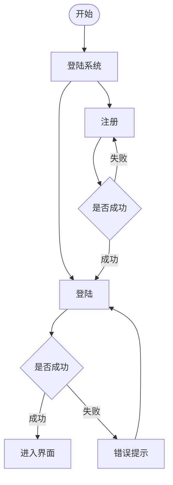
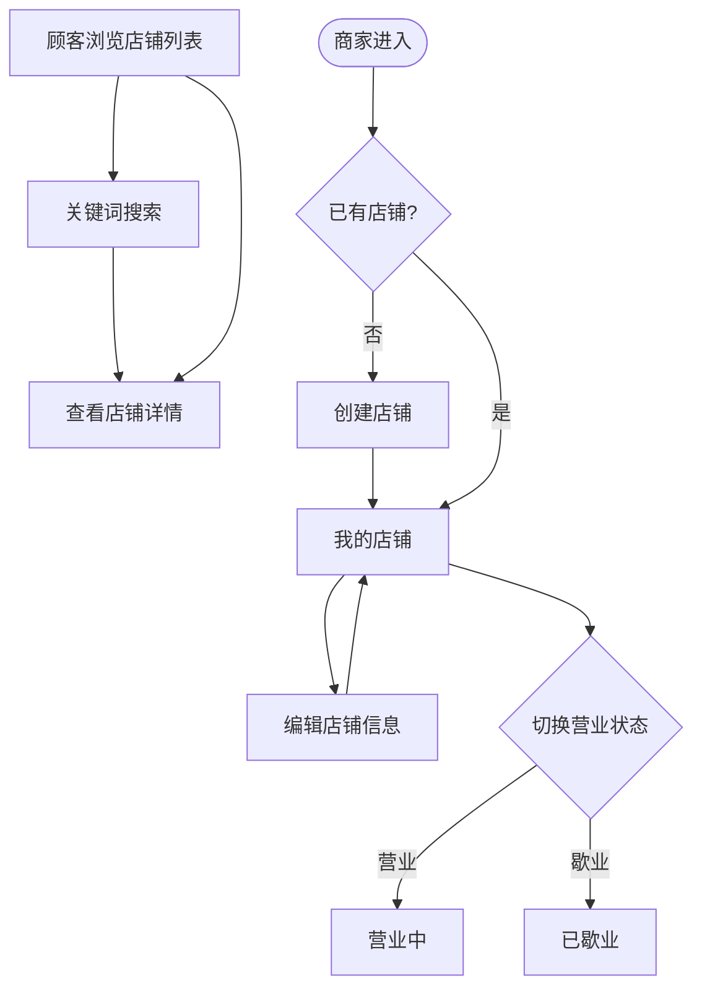
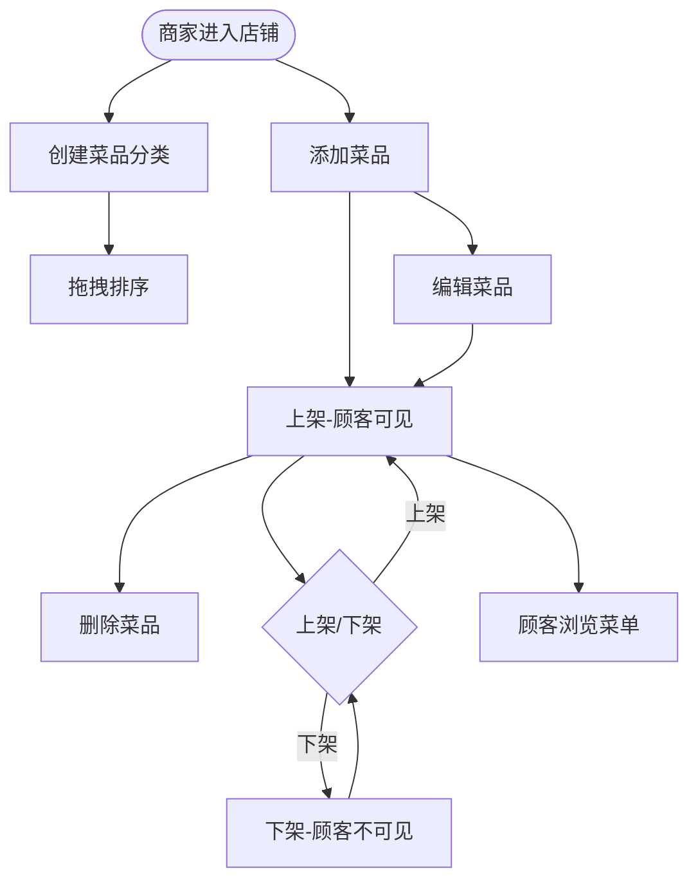
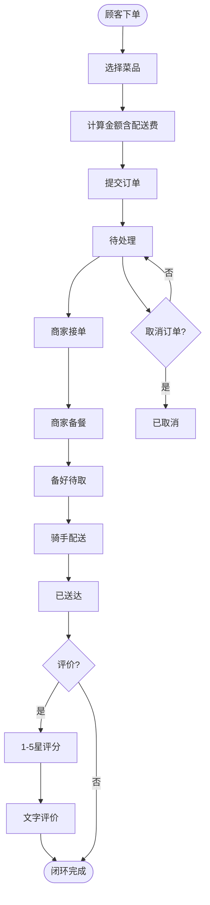
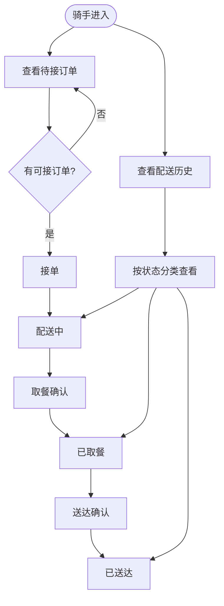

# 1.用户账号管理模块

支持用户注册与登录功能，新用户可自主选择顾客、商家、骑手三种角色完成账户注册。系统基于 Session 会话机制保障访问安全，登录后会话信息持久化存储。通过统一鉴权装饰器 `@require(role=...)` 实现角色级别的权限控制，未登录用户自动重定向至登录页，无权限操作将被拦截并提示。

# 2.商家店铺管理模块

商家可创建并管理自己的店铺，支持编辑店铺名称、地址、电话、描述等基本信息。提供营业状态一键切换功能，商家可在"营业中"与"已歇业"之间灵活控制店铺对外可见性。顾客可浏览所有营业中店铺列表并支持关键词搜索，点击进入店铺详情页查看完整菜单，为后续点餐下单提供数据入口。

# 3.菜品管理模块

商家可创建菜品分类并通过拖拽排序灵活调整展示顺序，实现菜单结构的自由编排。菜品支持完整的 CRUD 操作，包括添加、编辑、删除以及上架/下架状态切换。上架菜品对顾客可见，下架菜品自动隐藏，确保顾客端始终展示准确的可用菜单数据，为下单流程提供可靠的菜品信息支撑。

# 4.订单处理模块

顾客浏览商家菜单选择菜品后提交下单请求，系统自动计算总金额（含配送费）并生成订单。商家按流程依次执行接单、备餐、备好待取操作，推动订单状态从"待处理"流转至"待取餐"。支持顾客或商家在待处理及已确认阶段取消订单。订单送达后顾客可进行 1-5 星评分与文字评价，形成"下单—备餐—配送—评价"闭环流程。

# 5.配送管理模块

骑手可查看所有状态为"待取餐"且未被接单的订单列表，自主选择接单。接单后依次完成取餐确认和送达确认操作，系统自动记录取餐时间和送达时间，实现配送全流程的时间追踪。骑手可分类查看个人配送历史记录，涵盖配送中、已取餐、已送达三种状态的订单，便于统一管理配送任务。

