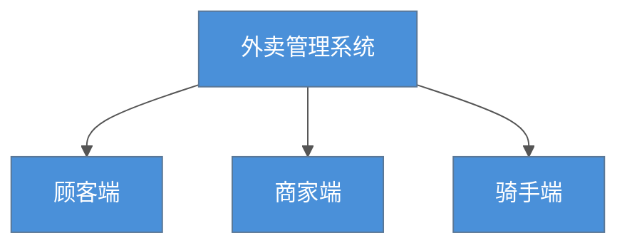
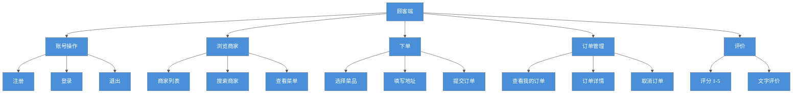
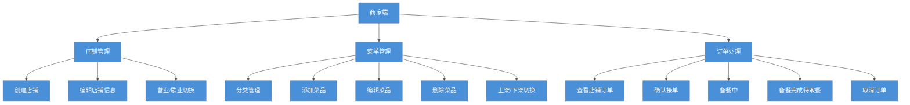
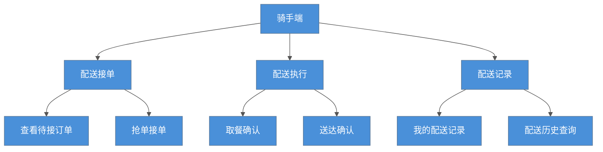
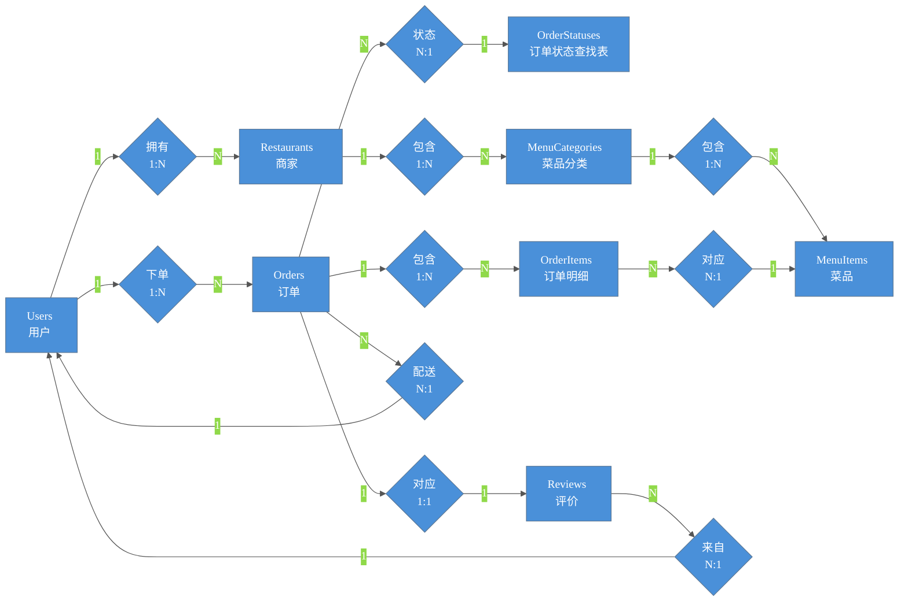
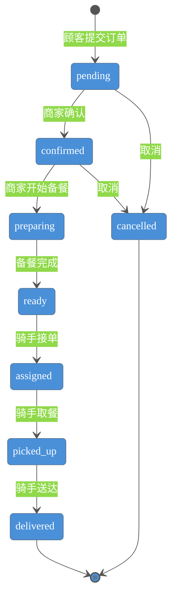

# 外卖管理系统 — 系统设计文档

---

## 一、功能结构图

### 总览



### 1.1 顾客端功能



### 1.2 商家端功能



### 1.3 骑手端功能




## 二、E-R 图 (实体关系图)



---

## 三、订单状态流转



---

## 四、数据表结构

### 0. OrderStatuses — 订单状态查找表

| 字段名 | 数据类型 | 备注 |
|--------|----------|------|
| status_code | NVARCHAR(20) | 主键，状态编码 (pending/confirmed/preparing/ready/assigned/picked_up/delivered/cancelled) |
| display_name | NVARCHAR(50) | 状态中文显示名 (待处理/已确认/备餐中/待取餐/配送中/已取餐/已送达/已取消) |
| sequence | INT | 排序序号，控制状态展示顺序 |
| is_terminal | BIT | 是否终态，0=中间态 1=终态 (delivered/cancelled 为终态) |

### 1. Users — 用户表

| 字段名 | 数据类型 | 备注 |
|--------|----------|------|
| user_id | INT IDENTITY(1,1) | 主键，自增 |
| username | NVARCHAR(50) | 用户名，唯一约束 UNIQUE |
| password_hash | NVARCHAR(255) | 密码哈希值 (scrypt 加密) |
| real_name | NVARCHAR(50) | 真实姓名 |
| phone | NVARCHAR(20) | 手机号码 |
| email | NVARCHAR(100) | 电子邮箱，可空 |
| address | NVARCHAR(200) | 地址信息，可空 |
| role | NVARCHAR(20) | 角色：customer(顾客) / merchant(商家) / rider(骑手)，默认 customer |
| created_at | DATETIME2 | 创建时间，默认 GETDATE() |

### 2. Restaurants — 商家表

| 字段名 | 数据类型 | 备注 |
|--------|----------|------|
| restaurant_id | INT IDENTITY(1,1) | 主键，自增 |
| owner_id | INT | 外键 → Users.user_id，商家 owner，ON DELETE CASCADE |
| name | NVARCHAR(100) | 店铺名称 |
| address | NVARCHAR(200) | 店铺地址 |
| phone | NVARCHAR(20) | 店铺联系电话 |
| description | NVARCHAR(500) | 店铺简介，可空 |
| logo_url | NVARCHAR(255) | 店铺 Logo 图片 URL，可空 |
| status | NVARCHAR(20) | 营业状态：open(营业中) / closed(歇业)，默认 open |
| created_at | DATETIME2 | 创建时间，默认 GETDATE() |
| updated_at | DATETIME2 | 更新时间，默认 GETDATE() |

### 3. MenuCategories — 菜品分类表

| 字段名 | 数据类型 | 备注 |
|--------|----------|------|
| category_id | INT IDENTITY(1,1) | 主键，自增 |
| restaurant_id | INT | 外键 → Restaurants.restaurant_id，ON DELETE CASCADE |
| name | NVARCHAR(50) | 分类名称 (如：招牌热菜、凉菜、主食、饮品) |
| sort_order | INT | 排序序号，默认 0，数字越小越靠前 |
| updated_at | DATETIME2 | 更新时间，默认 GETDATE() |

### 4. MenuItems — 菜品表

| 字段名 | 数据类型 | 备注 |
|--------|----------|------|
| item_id | INT IDENTITY(1,1) | 主键，自增 |
| restaurant_id | INT | 外键 → Restaurants.restaurant_id |
| category_id | INT | 外键 → MenuCategories.category_id |
| name | NVARCHAR(100) | 菜品名称 |
| description | NVARCHAR(500) | 菜品描述，可空 |
| price | DECIMAL(10,2) | 单价，CHECK >= 0 |
| image_url | NVARCHAR(255) | 菜品图片 URL，可空 |
| status | NVARCHAR(20) | 状态：available(上架) / unavailable(下架)，默认 available |
| updated_at | DATETIME2 | 更新时间，默认 GETDATE() |

### 5. Orders — 订单表 (含配送字段)

| 字段名 | 数据类型 | 备注 |
|--------|----------|------|
| order_id | INT IDENTITY(1,1) | 主键，自增 |
| customer_id | INT | 外键 → Users.user_id，下单顾客 |
| restaurant_id | INT | 外键 → Restaurants.restaurant_id，接单商家 |
| rider_id | INT | 外键 → Users.user_id，配送骑手，可空 (配送前为 NULL) |
| delivery_address | NVARCHAR(200) | 配送地址 |
| status | NVARCHAR(20) | 外键 → OrderStatuses.status_code，订单状态，默认 pending |
| total_amount | DECIMAL(10,2) | 订单总金额（菜品合计 + 配送费），CHECK >= 0，默认 0 |
| delivery_fee | DECIMAL(10,2) | 配送费，CHECK >= 0，默认 5.00 |
| note | NVARCHAR(500) | 订单备注 (如：少放辣、不要糖)，可空 |
| pickup_time | DATETIME2 | 骑手取餐时间，可空 |
| delivery_time | DATETIME2 | 骑手送达时间，可空 |
| created_at | DATETIME2 | 创建时间，默认 GETDATE() |
| updated_at | DATETIME2 | 更新时间，默认 GETDATE() |

### 6. OrderItems — 订单明细表

| 字段名 | 数据类型 | 备注 |
|--------|----------|------|
| order_item_id | INT IDENTITY(1,1) | 主键，自增 |
| order_id | INT | 外键 → Orders.order_id，ON DELETE CASCADE |
| item_id | INT | 外键 → MenuItems.item_id |
| quantity | INT | 数量，CHECK > 0 |
| unit_price | DECIMAL(10,2) | 下单时的菜品单价，CHECK >= 0 (快照价格，不随菜品改价而变) |

### 7. Reviews — 评价表

| 字段名 | 数据类型 | 备注 |
|--------|----------|------|
| review_id | INT IDENTITY(1,1) | 主键，自增 |
| order_id | INT | 外键 → Orders.order_id，UNIQUE 约束 (一个订单只能评价一次) |
| customer_id | INT | 外键 → Users.user_id，评价顾客 |
| rating | TINYINT | 评分 1-5，CHECK BETWEEN 1 AND 5 |
| comment | NVARCHAR(500) | 文字评价，可空 |
| created_at | DATETIME2 | 评价时间，默认 GETDATE() |
```
